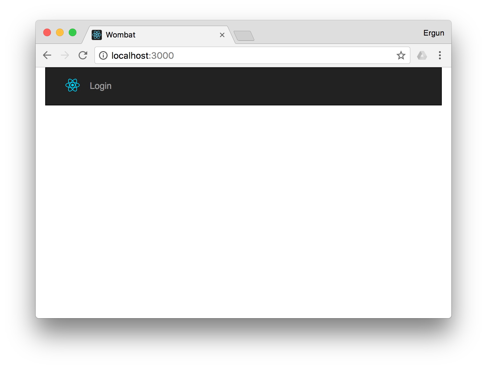

# Wombat
## A password manager on Amazon Cloud
Keep your household data safe, protected by strong encryption and authentication. Access your data from anywhere in the world using any device or computer.

## Screenshots

> Note: Screenshots below show insecure localhost versions of Wombat. When deployed on your domain, the web application should be secured by HTTPS.

### Simple
Simple secure web interface to access your sensitive data anywhere, using any device, any brand, desktop or mobile alike:


 
 ### Autocomplete
Seamless auto-complete search. Click the link to preview or click the copy icon to copy contents to clipboard.

 

## Wombat Technology Stack 

Wombat uses AWS serverless technology. You only pay when you load your data on the front-end web application. The cost depends on usage, but typically it wouldn't exceed one or two dollars per month.

Wombat uses:
- React
- Node.js
- AWS API Gateway
- AWS Lambda
- AWS S3
- AWS CloudFront
- AWS Route53
- AWS CloudFormation

## Best practices

- Plain passwords must not be stored anywhere.
- Sensitive data should be kept in environment files.
- Sensitive data should be encrypted.
- Sensitive data should not be checked in under source control.

## AWS Setup

- [Step 1 - Create an AWS account](http://68-kb.blogspot.com.au/2017/04/hdc-create-aws-account.html)
- [Step 2 - Register a domain name](http://68-kb.blogspot.com.au/2017/04/hdc-amazon-route-53.html)
- [Step 3 - Request a certificate](http://68-kb.blogspot.com.au/2017/04/hdc-aws-certficate-manager.html)
- Step 4 - Configure AWS CloudFront to host your web app's end point
- Step 5 - Configure AWS Route53 and create an ALIAS for your front-end app
- Step 6 - Configure a Custom Domain under AWS API Gateway to host your back-end api
- Step 7 - Configure AWS Route53 and create an ALIAS for your back-end api

## Local Setup

- [Step 1 - Download Node.js (6.10.0) and npm](https://www.npmjs.com/get-npm)
- [Step 2 - Install serverless with -g](https://serverless.com/) = 1.25.0

## Commands

### Encrypt your data file
Create a text file with extension `*.tab` that contains your personal data. In this file, each line should have a name, followed by a TAB character, followed by a value:
```
Barclays Bank password	abc123
Barclays Bank ATM password	abc123
...
```
Let's say your file is called `sample.tab`. Before you deploy it you need to encrypt its contents using your login password.
> Your password is never stored anywhere.

Enter these commands:
```
cp sample.tab crypto
cd crypto
node app sample
```

## Point to node v8.10.0
```
nvm use 8.10.0
```

### Deploy back-end
```
./deploybe
```

### Deploy front-end
```
./deployfe
```
### Develop front-end on localhost
```
cd web
./express
```
